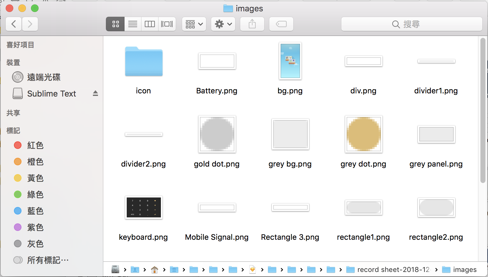

# FDSketch2Unity

This module consists of two parts: **sketch2json** and **json2unity**.

- **sketch2json** is a sketch plugin that generates json files and images in your Sketch file, whcih supports Sketch up to version 52.3 (and custom panel supports Sketch after version 43).

- **json2unity** then combines these files into Unity UI!

## sketch2json [for designers]

### Usage
1. Download **sketch2unity-xcode.sketchplugin**.

   

2. Double click **sketch2unity-xcode.sketchplugin** to install the plugin. (or Move the package **sketch2unity-xcode.sketchplugin** to the folder `~/Library/Application Support/com.bohemiancoding.sketch3/Plugins/` to install.)

3. Open Sketch and you'll see that **sketch2unity-xcode.sketchplugin** has been installed and that **Sketch2Unity custom panel** lies in Inspector.
   

   Set layout values of groups and symbols for Unity in the custom panel.
   

4. Arrange layers accordong to the **Sketch Convention** below.

5. Select the artboard or the group you want to export, and Use shortcut `ctrl + shift + x` or Choose `Plugins > sketch2unity-xcode > export` to export UI files.

6. Once UI files are exported, you'll see the following message:
   

   and exported UI files in the plugin folder:
   
   
   
   
   
   To view these files in Finder, use `command + shift + g` to go to plugin folder.

7. Load json file by the copied path if Sketch2Unity doesn't load automatically after pressing OK.

   
   

8. Use mouse or plus and minus key to zoom in and zoom out; use mouse drag or w, s, a, d key to move the UI.
   

9. If necessary, put fonts(.ttf, .otf) used in UI in a folder named Resources, and move the folder to `~/Library/Application Support/com.bohemiancoding.sketch3/Plugins/sketch2unity-xcode.sketchplugin/Contents/Sketch/FDPreview/`.

---

### Sketch Convention
#### 1. Group Hierachy
Arrange layers sharing the same layout properties in a group in order to maintain the hierachy of layout.

#### 2. Group
Sketch2Unity groups layers automatically to arrange each text layer and image layer in a group respectively in order to fit object structure of Unity.
It saves layout information for every group, so setting layout values in custom panel only works for group and symbol. (That is to say, setting layout values for text layers and bitmap layers is useless.)

#### 3. Symbol
The level of symbol is equivalent to group in the hierachy of layout.

#### 4. Image and Slice
All names of image layers shoud not be the same; otherwise, they will be overwritten.
Also, add slice to the group of image (1) composed of multiple subimages or (2) with transparent bound.

Remember to check **Export group contents only** in inspector to export removing-background image.

#### 5. Mask and Invisible Layer
Invisible layers will not be exported.
When a mask is used for shaping image, setting the mask as invisible results in a masked image.
For example, Sketch2Unity will export a circle masked image if you set the oval mask as invisible. 

#### 6. Combined Shape
Handle combined shape as a single image layer.

#### 7. Background
Set background color by adding a filled shape layer instead of setting background color to artboard.

#### 8. Line
Avoid using thickened line to generate shape like rectangle.

---

### Additional Remarks
When encountering the following two situations, Sketch2Unity will inform users:
1. there are images with same name;
2. there are more than one components in one group.

   

Here are proper responses to these two situations:
1. Confirm whether layer names of different images are different.
If so, then you can ignore this message; otherwise, rename repeated layer names and export UI again.

2. Check whether created groups change the view of UI.
If so, undo and arrange your layers according to **Sketch Convention 2**; otherwise, ignore this message.

---

## json2unity [for engineers]

### Usage
1. Clone **json2unity folder**
2. Add it to your Unity project and Compile.
3. Import exported json files and images folder to **Assets folder** in Unity.
4. If necessary, put fonts(.ttf, .otf) used in UI in a folder named Resources, and move the folder to Assets folder.
5. Right click on the exported json files and Choose `Create > Sketch2Unity > Import` to generate UI.
